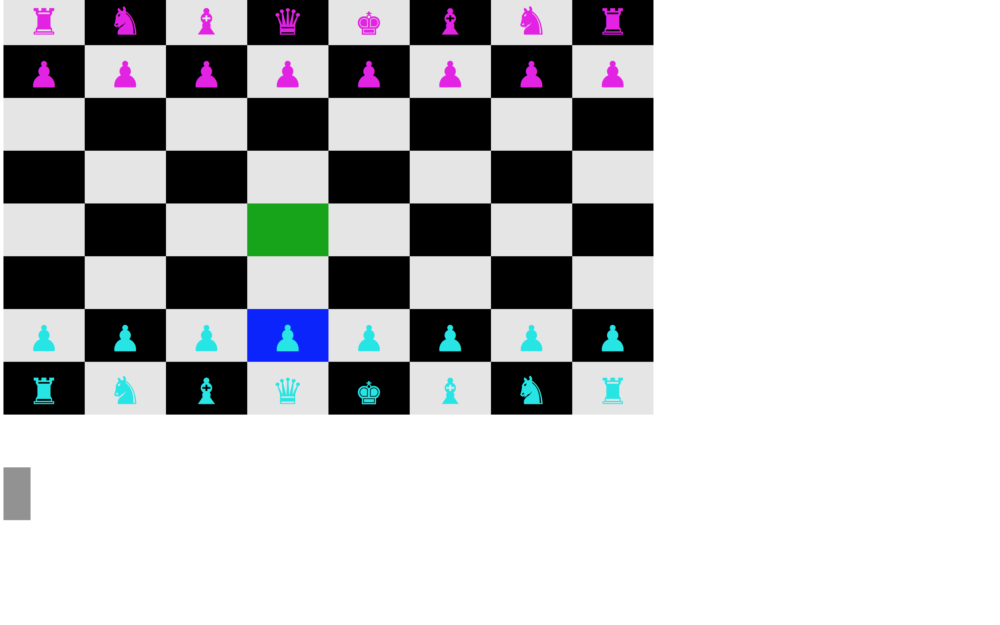

<h1>Chess</h1>

Play classic chess in the command line. The pieces and grid are rendered using the colorize gem and unicode chess characters.

</img>

To play:
* <a href="https://github.com/cssherry/chess/archive/gh-pages.zip">Download</a> and unzip this repository.
* Make sure ruby is installed on your computer.
* Navigate to the project folder and run `ruby "chess.rb"`
* Use the arrow keys and enter to select the piece you want to move.
